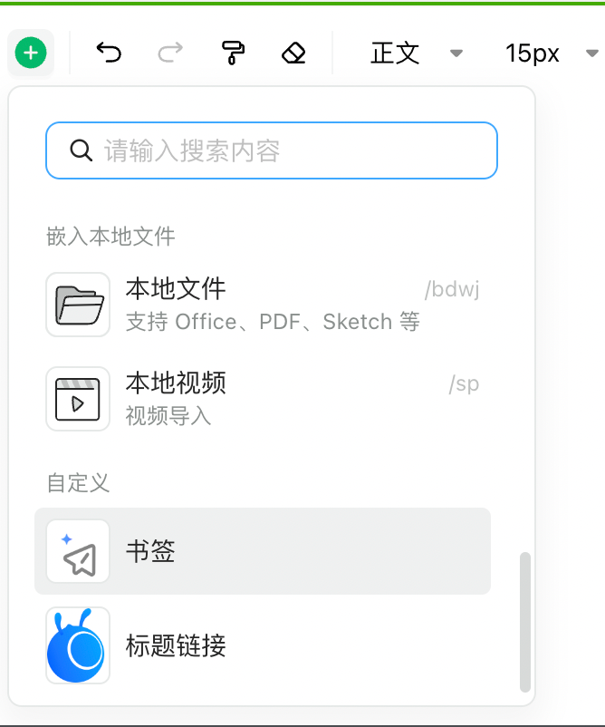

# 开发自定义卡片

- [配置项](#%E9%85%8D%E7%BD%AE%E9%A1%B9)
- [卡片描述](#%E5%8D%A1%E7%89%87%E6%8F%8F%E8%BF%B0)
  * [name](#name)
  * [cardType](#cardtype)
  * [slash](#slash)
  * [initValue](#initvalue)
  * [editorComponent](#editorcomponent)
  * [viewerComponent](#viewercomponent)
  * [writeText](#writetext)
  * [writeHtml](#writehtml)
  * [readHtml](#readhtml)
- [特别注意](#%E7%89%B9%E5%88%AB%E6%B3%A8%E6%84%8F)

---

开发自定义卡片有两种途径，一种是自己创建一个插件，可以参考现有的卡片插件的写法，这种方法可以最大程度地利用所有编辑器内部的api完成丰富的功能，但较为复杂。

所以编辑器也提供了另一种**配置式的方法**，只需要简单配置即可实现一个基于`React`UI的自定义卡片。

# 配置项

和插件配置方式相同，要分别在创建编辑器和阅读器的时候传入`customCard`配置，**编辑器和阅读器可以使用同一份配置**。

```typescript
createOpenEditor(node, {
  customCard: { cards: [] }
})
```

`cards`：注册的所有卡片，每一种卡片的定义参考卡片描述

# 卡片描述

## name

<code><font style="color:#7E45E8;">string</font></code>

卡片名称。会被内部存储在卡片的`cardValue`的`$name`字段上，应确保唯一性，在读取数据时会根据该字段渲染自定义的react组件

## cardType

<code><font style="color:#7E45E8;">'inline' | 'block'</font></code>

卡片类型。分为行内和区块卡片，行内卡片布局时会和文本处于一行连续布局，区块卡片则独占一行。这和浏览器技术的概念是一致的[常规流中的块和内联布局 - CSS：层叠样式表 | MDN](https://developer.mozilla.org/zh-CN/docs/Web/CSS/CSS_flow_layout/Block_and_inline_layout_in_normal_flow)。

## slash

<code><font style="color:#7E45E8;">object</font></code>

配置斜杠命令面板以及工具栏的`cardselect`菜单面板

```typescript
 {
    /** 图标 */
    icon: React.ReactNode;
    /**
     * 斜杆面板的搜索提示，提示用户搜索，例如：/glk
     */
    mainSearch?: string;
    /**
     * 关键字，搜索的时候根据关键字进行查找
     */
    keywords?: string | string[];
    /**
     * 选项名称，例如：高亮块
     */
    label: string;
    /**
     * 选项描述，例如：高亮文本
     */
    description?: string | (() => string | null);
  };
```

slash配置好了并不会直接展示在面板中，斜杠命令面板的展示依然遵循编辑器的`slash`配置项，你可以直接修改lakex提供的默认配置项，要注意的是自定义斜杠命令菜单名称为`custom-${name}`，其中`name`是你配置的自定义卡片的名称。

```typescript
// 此处有问题 等待补充。

// 向现有的菜单面板中追加一组
// @ts-ignore
slashOption!.cardSelect!.general.groups.push({
  title: '自定义',
  name: 'group-custom',
  type: 'normal',
  items: ['custom-bookmark', 'custom-bookmarkTitle'],
});
```



之后就能在命令面板中看到这个`自定义`组的菜单项了

## initValue

<code><font style="color:#7E45E8;">Record<string, any> | null</font></code>

创建自定义卡片的初始数据，如果不需要初始数据请传null。**自定义卡片数据请不要使用**<code>**$name**</code>**保留字段。也不要定义复杂的卡片数据如函数、循环引用等，复杂数据在序列化过程中会丢失。**

## editorComponent

<code><font style="color:#7E45E8;">ReactCtorLike<ICustomEditorCardProps<TCardValue>></font></code>

编辑模式的组件的构造函数，支持函数式和类组件。组件的props接口如下

```typescript
export interface ICustomEditorCardProps<TCardValue = any> {
  editor: IEditor;
  cardValue: TCardValue;
  /** 更新数据，会触发组件重新渲染 */
  updateCardValue: (value: TCardValue) => void;
  cardType: 'inline' | 'block';
}
```

通常你可能需要在没有`cardValue`的情况下渲染一个支持编辑的组件用于将数据写入到卡片内部

## viewerComponent

<code><font style="color:#7E45E8;">ReactCtorLike<ICustomViewerCardProps<TCardValue>></font></code>

阅读模式的组件的构造函数，支持函数式和类组件。组件的props接口如下

```typescript
export interface ICustomEditorCardProps<TCardValue = any> {
  viewer: IViewer;
  cardValue: TCardValue;
  /** 更新数据，会触发组件重新渲染 */
  updateCardValue: (value: TCardValue) => void;
  cardType: 'inline' | 'block';
}
```

在阅读模式下要谨慎调用`updateCardValue`更新数据，可能需要做鉴权操作。

## writeText

<code><font style="color:#7E45E8;">(value: TCardValue | null) => string;</font></code>

配置这个方法可以在复制数据、获取指定格式的文档内容的场景下，自定义`text/plain`格式的数据内容，以便粘贴到其他应用中或导出数据。**默认为空字符串。**

## writeHtml

<code><font style="color:#7E45E8;">(value: TCardValue | null) => string;</font></code>

配置这个方法可以在复制数据、获取指定格式的文档内容的场景下，自定义`text/html`格式的数据内容，以便粘贴到其他应用中或导出数据。返回值为html字符串。**默认为空字符串。**

实际上写出的html格式数据如下

```typescript
<div 
  data-name="customInline" 
  data-value="%7B%22%24name%22%3A%22bookmarkTitle%22%2C%22title%22%3A%22d%22%2C%22desc%22%3A%22f%22%2C%22url%22%3A%22g%22%7D" 
  data-custom-name="bookmarkTitle" 
  id="C8RWF" 
  class="ne-custom-card"
>
    /** 这里是自定义的html内容 */
</div>


```

## readHtml

暂未支持

# 特别注意

由于数据可能会被持久化在你的数据库中，对于数据格式的定义和写出一定要谨慎，尽量做到向后兼容。否则你可能需要做数据订正了。
