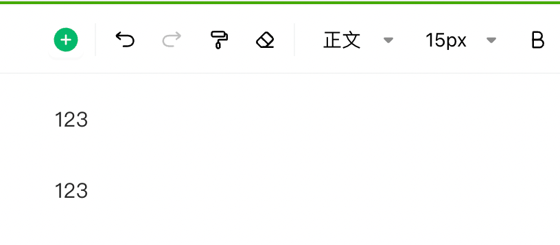
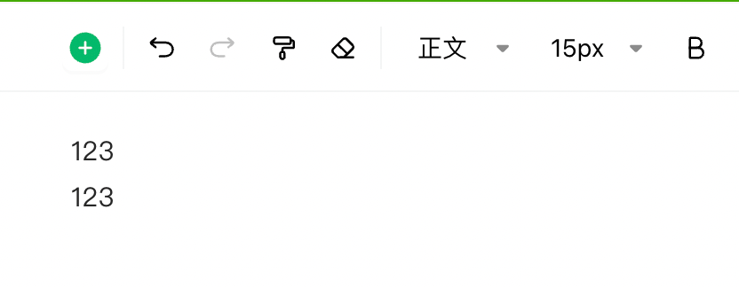

# html数据（htmlDataSource)

- [编辑模式配置项](#%E7%BC%96%E8%BE%91%E6%A8%A1%E5%BC%8F%E9%85%8D%E7%BD%AE%E9%A1%B9)
  * [readEmptyLine](#reademptyline)

---

# 编辑模式配置项

## readEmptyLine

<code><font style="color:#7E45E8;">boolean</font></code>

是否读取空行，默认为`false`，即使用html渲染文档会忽略空行。举个例子：

编辑器内容有一个空行



得到的html数据如下

```html
<div class="lake-content" typography="classic">
  <p id="u3468eb57" class="ne-p"><span class="ne-text">123</span></p>
  <p id="u53cb9d54" class="ne-p"><span class="ne-text"></span></p>
  <p id="uc3165bef" class="ne-p"><span class="ne-text">123</span></p>
</div>
```

如果没有配置该项，直接使用`text/html`格式初始化文档时，第二个空`p`会被忽略，渲染结果如下（和编辑模式不一致）


