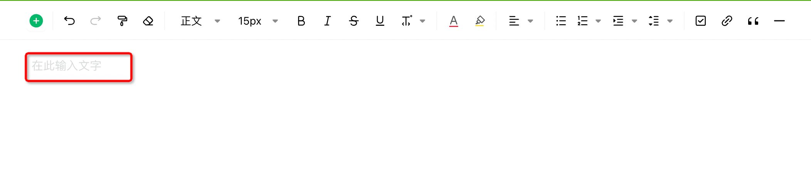

# 占位文案（placeholder）

- [编辑模式配置项](#%E7%BC%96%E8%BE%91%E6%A8%A1%E5%BC%8F%E9%85%8D%E7%BD%AE%E9%A1%B9)
  * [tip](#tip)
  * [emptyParagraphTip](#emptyparagraphtip)

---



仅支持编辑模式。

# 编辑模式配置项

可以只传一个字符串，如

```typescript
const option = {
  placeholder: "请输入文字"
};
```

也支持配置一个对象

## tip

<code><font style="color:#7E45E8;">string</font></code>

编辑器空内容时展示的提示文案。配置效果等价于直接配置一个字符串。

## emptyParagraphTip

<code><font style="color:#7E45E8;">string</font></code>

在光标聚焦的空段落首的提示文案。单独配置不生效。

```javascript
const option = {
  placeholder: {
    tip: '请输入文字',
    emptyParagraphTip: '输入 / 唤起更多',
  },
};
```
