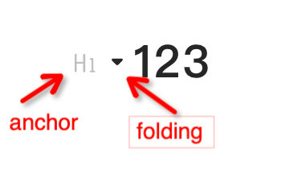

# 多级标题（heading）

- [配置项](#%E9%85%8D%E7%BD%AE%E9%A1%B9)
  * [generateHashLink](#generatehashlink)
  * [anchor](#anchor)
  * [folding](#folding)

---

阅读模式和编辑模式配置项相同。

# 配置项

## generateHashLink

<code>(url: string | URL, id: string) => string | null</code>

根据当前页面地址和标题节点id生成hash链接。需自行处理链接的跳转行为，通常用于分享给别人快速跳转到指定文档位置。

## anchor

<code>boolean</code>

标题锚点，点击锚点会**复制**当前标题的hash链接，默认为false。如果需要该功能，则必须配置`generateHashLink`，否则将会提示复制失败。

## folding

<code>boolean</code>

标题折叠，点击会收起当前层级标题下的所有内容。默认启用该功能。
