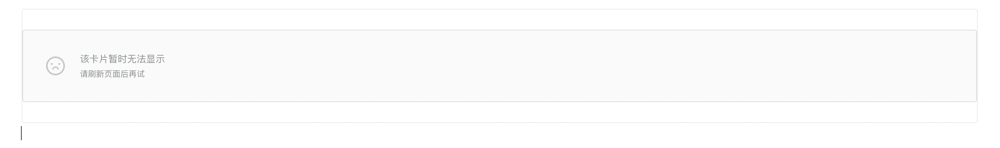

# 异常卡片 （fallbackcard）

- [编辑模式配置项](#%E7%BC%96%E8%BE%91%E6%A8%A1%E5%BC%8F%E9%85%8D%E7%BD%AE%E9%A1%B9)
  * [mainTipHTML](#maintiphtml)
  * [subTipHTML](#subtiphtml)

---

对于不支持的卡片将会使用异常卡片作为占位`UI`。支持配置提示文案

# 编辑模式配置项

## mainTipHTML

<code>string</code>

默认值为`该卡片暂时无法显示`

## subTipHTML

<code>string</code>

默认值为`请刷新页面后再试`
