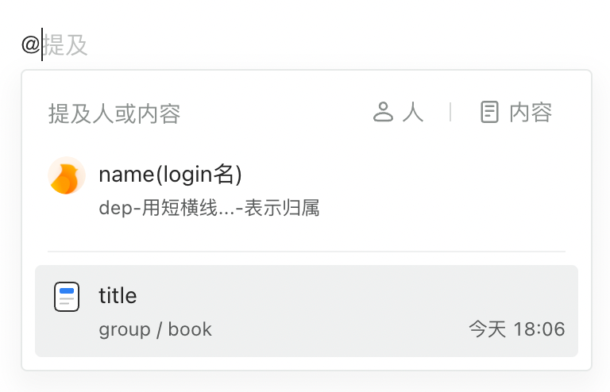

# 提及（mention）

- [提及项](#%E6%8F%90%E5%8F%8A%E9%A1%B9)
- [配置项](#%E9%85%8D%E7%BD%AE%E9%A1%B9)
  * [avatarOrigin](#avatarorigin)
  * [defaultList](#defaultlist)
  * [editUI](#editui)
  * [enableQuickInput](#enablequickinput)
  * [externalOpen](#externalopen)
  * [generateMentionInfo](#generatementioninfo)
  * [mentionURL](#mentionurl)
  * [mentionURLParams](#mentionurlparams)
  * [multiTypes](#multitypes)
  * [onAfterKernelPluginInit](#onafterkernelplugininit)
  * [onMentionSearch](#onmentionsearch)
  * [origin](#origin)
  * [recordURL](#recordurl)
  * [viewerUI](#viewerui)
  * [popupContainer1.7.0](#popupcontainer170)

---



# 提及项

:::warning
目前还不支持内容，配置时忽略相关配置

:::

提及的内容可以是人或者文档。对应的接口如下。参数的UI含义可以参考头图。默认只支持提及人。如果想要支持两种，需要配置`[multiTypes](https://yuque.antfin-inc.com/lark/lakex-doc/sk5fri38i6lz4ae3#multiTypes)`

人

```typescript
export type MentionUserData = {
  id: string;
  nickName: Nullable<string>;
  name: string;
  avatar: string;
  avatar_url?: string;
  dep: string;
  login: string;
};


```

内容

```typescript
export type MentionContentData = {
  url: string;
  id: string;
  title: string;
  /** 目前支持各种文档类型，会展示相应UI */
  type: string;
  updated_at: string;
  group: string;
  book: string;
};

```

# 配置项

## avatarOrigin

<code><font style="color:#7E45E8;">string</font></code>

补全头像的完整url所需的origin。在提及列表项的头像图片资源前追加的链接信息，通常不需要配置，默认为空字符串。

## defaultList

<code><font style="color:#7E45E8;">(MentionResponse | (() => Promise<MentionResponse>))</font></code>

默认列表内容。类型如下。结合`[multiTypes](https://yuque.antfin-inc.com/lark/lakex-doc/sk5fri38i6lz4ae3#multiTypes)`配置选择正确的默认列表。也支持配置一个异步函数，以满足通过接口获取默认列表内容的能力。

```typescript
type MentionResponse = 
	| {
      docs: Array<MentionContentData>;
      users: Array<MentionUserData>;
  	}
	| Array<MentionUserData>
```

## editUI

<code><font style="color:#7E45E8;">Class<any, IEditCardUI<any>></font></code>

详见卡片UI配置部分。

## enableQuickInput

<code><font style="color:#7E45E8;">boolean</font></code>

是否支持快捷键输入，默认为`true`。快捷键为`@`。

## externalOpen

<code><font style="color:#7E45E8;">boolean</font></code>

跳转提及人的链接是否新开标签页，默认为`false`。

## generateMentionInfo

<code><font style="color:#7E45E8;">(detail: { login?: Nullable<string>; nickName?: Nullable<string>; name?: Nullable<string>; }) => { text: Nullable<string>; url: Nullable<string>; externalOpen: boolean; }</font></code>

根据人项的值，获取提及人时与UI相关的数据：文本、跳转链接和是否新开页跳转。如果不传则使用内置的一套逻辑。

## mentionURL

<code><font style="color:#7E45E8;">string</font></code>

获取提及列表的接口。接口使用get请求，要求接口返回内容与`[defaultList](https://yuque.antfin-inc.com/lark/lakex-doc/sk5fri38i6lz4ae3#defaultList)`中定义的响应数据结构一致

| **请求方式** | `GET` |
| :---: | --- |
| **请求值** | [#mentionURLParams](https://yuque.antfin-inc.com/lark/lakex-doc/sk5fri38i6lz4ae3#mentionURLParams) |
| **响应值** | 参考[#defaultList](https://yuque.antfin-inc.com/lark/lakex-doc/sk5fri38i6lz4ae3#defaultList)<br/><code>json {   "data": {     /** MentionResponse */ 	} } </code>  |

## mentionURLParams

<code><font style="color:#7E45E8;">object | (input: string, tab?: 'users' | 'docs') => object</font></code>

提及接口的入参，支持一个函数。函数的第一个入参为当前用户输入的字符。

## multiTypes

<code><font style="color:#7E45E8;">boolean</font></code>

是否支持提及内容，默认为`false`。

## onAfterKernelPluginInit

<code><font style="color:#7E45E8;">(kernel: IKernel) => void</font></code>

kernel插件初始化之后的钩子，可以在此实现一些业务逻辑

## onMentionSearch

<code><font style="color:#7E45E8;">(input: string, tab: 'users' | 'docs') => Promise<MentionResponse></font></code>

提及的查询接口，这个配置可以替代[#mentionURLParams](https://yuque.antfin-inc.com/lark/lakex-doc/sk5fri38i6lz4ae3#mentionURLParams)和[#mentionURL](https://yuque.antfin-inc.com/lark/lakex-doc/sk5fri38i6lz4ae3#mentionURL)。而且如果有了该配置，另外两个配置也是无效的。

## origin

<code><font style="color:#7E45E8;">Nullable<string></font></code>

内置的[#generateMentionInfo](https://yuque.antfin-inc.com/lark/lakex-doc/sk5fri38i6lz4ae3#generateMentionInfo)逻辑会使用这个参数生成跳转链接的路径：`encodeURI(`${origin}/${login}`)`。默认会使用`location.origin`

## recordURL

`string`

记录提及人的行为接口。用户从提及列表中选中了一个人之后随即向该api发起请求。请求方式为`POST`

| **请求方式** | `POST` |
| :---: | --- |
| **请求值** | <code>json {   "action_type": "mention",   "target_type": "User",   "target_id": "人的ID", } </code>  |
| **响应值** | `void` |

## viewerUI

<code><font style="color:#7E45E8;">Class<any, IViewerCardUI<any>></font></code>

阅读态的卡片UI配置，详细参考卡片UI部分内容。

## popupContainer<font style="background:#F8CED3;color:#70000D">1.7.0</font>

<code><font style="color:#7E45E8;">() => HTMLELement</font></code>

配置编辑模式下弹层的父容器，默认在编辑器内部，可以配置在body上
