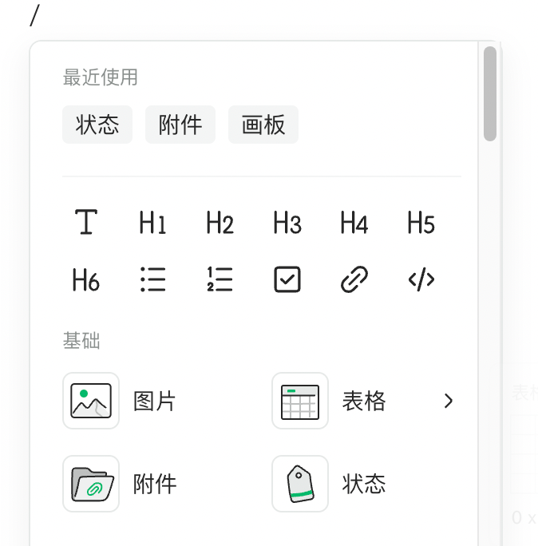
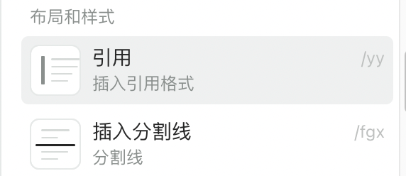
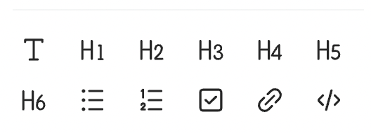
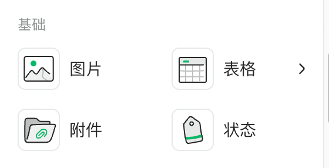

# 斜杠命令（slash）

- [编辑模式配置项](#%E7%BC%96%E8%BE%91%E6%A8%A1%E5%BC%8F%E9%85%8D%E7%BD%AE%E9%A1%B9)
  * [disableQuickInput](#disablequickinput)
  * [cardSelect](#cardselect)

---



***

在编辑页提供给用户快捷插入节点的快捷键，业界主流编辑器几乎都支持了这个操作。行首按下`/`或`\`，任意位置按下`ctrl(⌘) + /(\)`可以唤起该面板。

仅支持编辑模式的配置。

# 编辑模式配置项

## disableQuickInput

<code><font style="color:#7E45E8;">boolean</font></code>

是否禁用快捷键，默认为false，不禁用。某些情况下你可能不想开启斜杠面板，可以设为true。

## cardSelect

<code><font style="color:#7E45E8;">Record<string, ICardSelectOptionConfig></font></code>

```typescript
const config = {
  general: {
    groups: [
      {
        type: 'icon',
        show: 'slash',
        items: ['p', 'h1', 'h2', 'h3'],
      },
      {
        title: '基础',
        name: 'group-base',
        type: 'column',
        items: [
          'image',
          {
            name: 'table',
            allowSelector: true,
          },
          'file',
          'label',
        ],
      },
      {
        title: '画板类',
        name: 'group-board',
        type: 'normal',
        items: ['board', 'mindmap', 'flowchart'],
      },
    ],
  },
  table: {
    groups: [
      {
        type: 'icon',
        show: 'slash',
        items: [
          'p',
          'h1',
          'h2',
          'h3',
          'h4',
          'h5',
          'h6',
          'unorderedList',
          'orderedList',
          'taskList',
          'link',
          'code',
        ],
      },
      {
        title: '基础',
        name: 'group-base',
        type: 'column',
        items: ['image', 'file', 'label'],
      },
    ],
  },
};
```

菜单项配置，类型为一个对象，key为唤起斜杠面板的当前环境，支持下面几个值：

* `general`：正文内唤起
* `table`：单元格内唤起
* `collapse`：折叠块和分栏内唤起
* `simple`：在mini编辑器下正文内唤起（即配置了`uiSwitch`为`simple`的编辑器实例）

`ICardSelectOptionConfig`类型比较复杂，通常只需要配置`groups`字段即可。

`groups`即面板的分组，支持以下属性：

* `title`：展示名称
* `name`：唯一key
* `type`：当前组的布局样式，支持下面几种

`normal`：普通流式布局。包含图标、标题和描述信息。



`icon`：小图标布局。



`column`：两栏布局。包含图标和标题信息。



* `items`：当前组的菜单项，为一个数组。
  * 每一项可配置为一个字符串，支持的字符串可引入

```typescript
const { cardSelectItems } = window.Doc;
```

```
- 或者配置成一个带有二级菜单的对象，举个例子：
```

```typescript
const { cardSelectItems } = window.Doc;

const config = {
  groups:[
    {
      get title() {
        return i18n('布局和样式');
      },
      name: 'group-layout',
      type: 'normal',
      items: [
        cardSelectItems.quote,
        cardSelectItems.hr,
        cardSelectItems.alert,
        // 配置分栏带有二级菜单，可选两栏、三栏、四栏
        {
          name: cardSelectItems.columns,
          childMenus: [
            cardSelectItems.columns2,
            cardSelectItems.columns3,
            cardSelectItems.columns4,
          ],
        },
        cardSelectItems.collapse,
      ],
    },
  ]
}
```
