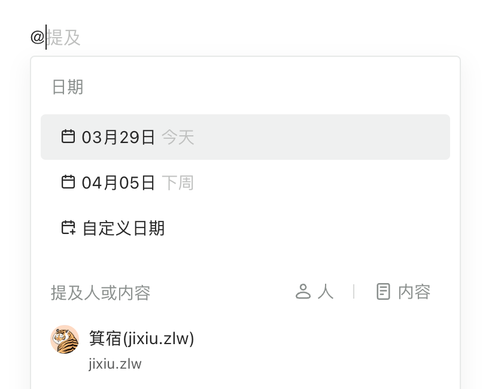
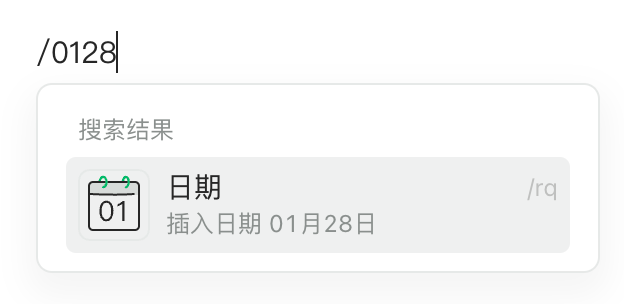

# 日期卡片（dateCard）

- [简介](#%E7%AE%80%E4%BB%8B)
- [配置](#%E9%85%8D%E7%BD%AE)
  * [supportMention](#supportmention)

---

## 简介

2024年03月29日

1. 支持 mention 选择日期

2. 支持斜杆选择日期
3. 

## 配置

### supportMention

<code>boolean</code>

是否支持 mention，默认是 true ，不需要可以配置成 false
