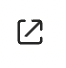
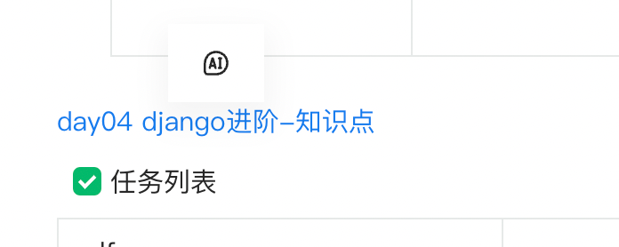

# 链接（link）

- [阅读模式配置项](#%E9%98%85%E8%AF%BB%E6%A8%A1%E5%BC%8F%E9%85%8D%E7%BD%AE%E9%A1%B9)
  * [vMiniToolbar](#vminitoolbar)

---

链接跳转的逻辑并没有内置在编辑器内，按钮点击默认没有跳转行为。请参考EnvAdapter进行配置：[适配器（envAdapter）](https://www.yuque.com/yuque/developer/ggspapip2fvgao1w)

# 阅读模式配置项

## vMiniToolbar

<code><font style="color:#7E45E8;">(node: VLinkElement) => VLinkMiniToolbarItem[]</font></code>

配置鼠标hover的情景工具栏。



入参为当前hover的link元素。返回值类型如下：

```typescript
export type VLinkMiniToolbarItem = {
  tooltip: string;
  icon: React.ReactNode | string;
  onClick: (node: VBoxNode) => void;
};
```
