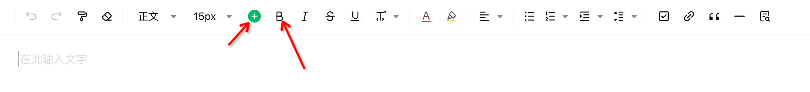
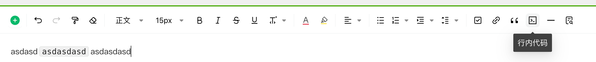
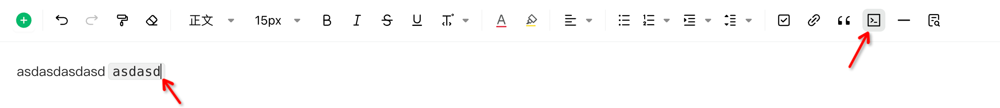
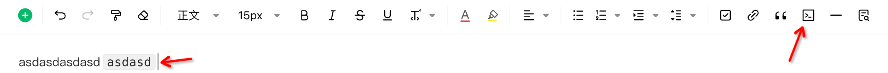
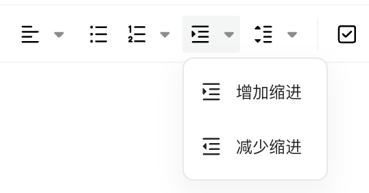
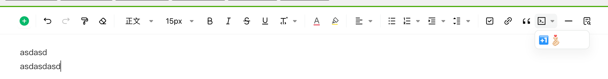
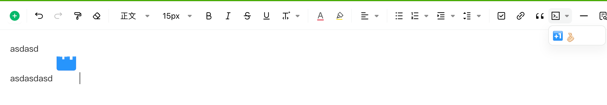

# 自定义工具栏（高级用法）

- [简单使用](#%E7%AE%80%E5%8D%95%E4%BD%BF%E7%94%A8)
- [删除某些项](#%E5%88%A0%E9%99%A4%E6%9F%90%E4%BA%9B%E9%A1%B9)
- [追加一些项在某项之前](#%E8%BF%BD%E5%8A%A0%E4%B8%80%E4%BA%9B%E9%A1%B9%E5%9C%A8%E6%9F%90%E9%A1%B9%E4%B9%8B%E5%89%8D)
- [自定义 toolbar](#%E8%87%AA%E5%AE%9A%E4%B9%89-toolbar)
  * [button 简单按钮](#button-%E7%AE%80%E5%8D%95%E6%8C%89%E9%92%AE)
  * [StatusButton 带有状态的按钮](#statusbutton-%E5%B8%A6%E6%9C%89%E7%8A%B6%E6%80%81%E7%9A%84%E6%8C%89%E9%92%AE)
  * [DropDownButton 下拉选择的按钮](#dropdownbutton-%E4%B8%8B%E6%8B%89%E9%80%89%E6%8B%A9%E7%9A%84%E6%8C%89%E9%92%AE)
  * [StatusDropdownButton 带有状态的下拉选择按钮](#statusdropdownbutton-%E5%B8%A6%E6%9C%89%E7%8A%B6%E6%80%81%E7%9A%84%E4%B8%8B%E6%8B%89%E9%80%89%E6%8B%A9%E6%8C%89%E9%92%AE)
- [使用 UMD 的场景](#%E4%BD%BF%E7%94%A8-umd-%E7%9A%84%E5%9C%BA%E6%99%AF)

---

> 目前编辑器带有默认的工具栏配置，如果只是更改部分或者追加，则需要把全部配置拷贝一份，过于复杂，这个时候可以使用 toolbarOptionHelper 对默认的配置进行调整

## 简单使用

```typescript
{
  toolbar: ToolbarOptionHelper.start().getOption(),
}
```

## 删除某些项

```typescript
import { toolbarItems } from '@alipay/lakex-doc/esm/app-open-editor/combine/toolbar';

const options = {
  toolbar: ToolbarOptionHelper
    	.start()
    	.removeItems([toolbarItems.cardSelect])
    	.getOption(),
}
```

## 追加一些项在某项之前



```typescript
import { toolbarItems } from '@alipay/lakex-doc/esm/app-open-editor/combine/toolbar';

const options = {
  toolbar: ToolbarOptionHelper
    	.start()
    	.removeItems([toolbarItems.cardSelect])
      // 插入到bold前面
      .insertBefore([toolbarItems.cardSelect], toolbarItems.bold),
    	.getOption(),
}
```

## 自定义 toolbar

在不改变原来的 toolbar 的情况下追加新的 `toolbar`。继承`ToolbarUIDescriptor`指定 `UI`类型就可以自定义一个`toolbar`

要实现以下方法

1. **getInitUIState** 返回初始状态
2. **getState** 选区变动后会重新获取状态，只要返回变动的状态即可
3. **onEvent** 产生了交互行为 (点击），调用该方法执行对应的编辑器命令。

### button 简单按钮

工具栏注册一个按钮，并在点击的时候执行命令。

下面是实现了一个行内代码块的按钮。

```typescript
import React from 'react';
import { ToolbarUIDescriptor } from '@alipay/lakex-doc/plugin-toolbar/public/toolbar-ui-descriptor';
import { CodeOutlined } from '@ant-design/icons';

export default class InlineCodeToolbarDescriptor extends ToolbarUIDescriptor<'Button'> {
  static override Type = 'Button';

  // 点击事件回调
  override onEvent(eventName: string, payload: any): void {
    // 当前光标位置插入行内代码
    // @ts-expect-error not error
    this.editor.execCommand('code');
  }

  getInitUIState() {
    return {
      disabled: this.disabled, // 是否处于禁用状态
      // 自定义图标，自行调节lineHeight让它视觉居中，字号一般是16
      icon: () => {
        return (
          <CodeOutlined
            style={{ fontSize: 16, color: 'black', lineHeight: 0.7 }}
          />
        );
      },
      className: 'ne-ui-toolbar-inline-code',
      // 展示tooltip
      tooltip: ToolbarUIDescriptor.getTooltip(
        this.editor,
        '行内代码',
        this.name,
      ),
    };
  }

  getUIState() {
    const { editor } = this;

    return {
      // @ts-expect-error not error
      disabled: this.disabled || !editor.queryCommandEnabled('code'),
    };
  }
}
```

插入到`分割线`前方

```typescript
{
  toolbar: ToolbarOptionHelper.start()
        // 插入到hr前面
        .insertBefore([InlineCodeToolbarDescriptor], toolbarItems.hr)
        .getOption(),
}
```

最终效果



### StatusButton 带有状态的按钮

跟 button 很像，多了一个状态指示当前是否处于某种状态，加粗、斜体就是这类的按钮

下面将行内代码的状态携带上

```typescript
import React from 'react';
import { COMMAND_EXECUTED } from '@alipay/lakex-doc/framework-public/constants/command-state';
import { ToolbarUIDescriptor } from '@alipay/lakex-doc/plugin-toolbar/public/toolbar-ui-descriptor';
import { CodeOutlined } from '@ant-design/icons';

export default class InlineCodeToolbarDescriptor extends ToolbarUIDescriptor<'StatusButton'> {
  static override Type = 'StatusButton';

  // 点击事件回调
  override onEvent(eventName: string, payload: any): void {
    // 当前光标位置插入行内代码
    // @ts-expect-error not error
    this.editor.execCommand('code');
  }

  getInitUIState() {
    return {
      // 光标是否位于行内代码
      checked: false,
      disabled: this.disabled, // 是否处于禁用状态
      // 自定义图标，自行调节lineHeight让它视觉居中，字号一般是16
      icon: () => {
        return (
          <CodeOutlined
            style={{ fontSize: 16, color: 'black', lineHeight: 0.7 }}
          />
        );
      },
      className: 'ne-ui-toolbar-inline-code',
      // 展示tooltip
      tooltip: ToolbarUIDescriptor.getTooltip(
        this.editor,
        '行内代码',
        this.name,
      ),
    };
  }

  getUIState() {
    const { editor } = this;

    return {
      checked: editor.queryCommandState('code') === COMMAND_EXECUTED,
      // @ts-expect-error not error
      disabled: this.disabled || !editor.queryCommandEnabled('code'),
    };
  }
}
```

插入到`分割线`前方

```typescript
{
  toolbar: ToolbarOptionHelper.start()
        // 插入到hr前面
        .insertBefore([InlineCodeToolbarDescriptor], toolbarItems.hr)
        .getOption(),
}
```

最终效果



### DropDownButton 下拉选择的按钮

点击后回弹出一个下拉选择框，可以方便将一组类似的命令放到一起

下面是缩进的实现

```typescript
import { i18n } from '@alipay/lakex-doc/framework-infra/locale';
import { assert } from '@alipay/lakex-doc/framework-utils/assert';
import type { IEditor } from '@alipay/lakex-doc/framework-editor/public/i-editor';
import { COMMAND_UNAVAILABLE } from '@alipay/lakex-doc/framework-public/constants/command-state';
import { ToolbarUIDescriptor } from '@alipay/lakex-doc/plugin-toolbar/public/toolbar-ui-descriptor';

const ICONS = {
  indent: 'editor-indent',
  outdent: 'editor-outdent',
};

function getItems(editor: IEditor) {
  const TEXT = {
    indent: i18n('增加缩进'),
    outdent: i18n('减少缩进'),
  };

  return [
    {
      icon: ICONS.indent,
      label: TEXT.indent,
      value: 'indent',
      tooltip: ToolbarUIDescriptor.getTooltip(editor, '', 'indent'),
    },
    {
      icon: ICONS.outdent,
      label: TEXT.outdent,
      value: 'outdent',
      tooltip: ToolbarUIDescriptor.getTooltip(editor, '', 'outdent'),
    },
  ];
}

export default class IndentToolbarDescriptor extends ToolbarUIDescriptor<'DropdownButton'> {
  static override Type = 'DropdownButton';

  override onEvent(eventName: string, type: 'indent' | 'outdent') {
    assert(eventName === 'select');
    assert(['indent', 'outdent'].includes(type));
    // @ts-expect-error TS(2345) FIXME-声明executeCommand所属类在该调用处以来的plugin class作为其PluginRelayList的范型值: Argument of type 'string' is not assignable to parameter of type 'never'.
    this.editor.execCommand(type);
  }

  getInitUIState() {
    return {
      disabled: this.disabled,
      allowCheck: false,
      value: null,
      icon: ICONS.indent,
      tooltip: i18n('缩进调整'),
      className: 'ne-ui-toolbar-indent',
      dropdownClassName: 'ne-ui-toolbar-indent-dropdown',
      items: getItems(this.editor),
    };
  }

  getUIState() {
    const { editor } = this;

    return {
      disabled:
        this.disabled ||
        // @ts-expect-error TS(2345) FIXME-传递调用command方法的类依赖的plugin范型值：https://yuque.antfin-inc.com/forces/lakex/omedms5k638u9iu5#xntvH
        editor.queryCommandState('indent') === COMMAND_UNAVAILABLE,
    };
  }
}
```



### StatusDropdownButton 带有状态的下拉选择按钮

可以使用 React 组件自定义下拉框内容，并带有一个下拉的图标

下面是自定义一个表情插入的 toolbar

```typescript
import React from 'react';
import { ToolbarUIDescriptor } from '@alipay/lakex-doc/plugin-toolbar/public/toolbar-ui-descriptor';
import { CodeOutlined } from '@ant-design/icons';

const emojiData = [
  {
    alt: '[+1]',
    src: 'https://aliwork-files.oss-accelerate.aliyuncs.com/aliway/emoji/TB1h6l7lfzO3e4jSZFxXXaP_FXa-96-96.gif',
  },
  {
    alt: '[比心]',
    src: 'https://aliwork-files.oss-accelerate.aliyuncs.com/aliway/emoji/TB1hHYEl8Bh1e4jSZFhXXcC9VXa-96-96.gif',
  },
];

export function DingEmoji(props: { onSelect: (src: string) => void }) {
  return (
    <div
      style={{
        width: 100,
        padding: 5,
      }}
    >
      {emojiData.map(v => (
        <span
          key={v.alt}
          style={{
            cursor: 'pointer',
            display: 'inline-block',
          }}
          onClick={() => props.onSelect(v.src)}
        >
          
        </span>
      ))}
    </div>
  );
}

export default class DingEmojiToolbarDescriptor extends ToolbarUIDescriptor<'StatusDropdownButton'> {
  static override Type = 'StatusDropdownButton';

  // 自定义组件 不需要此事件
  override onEvent(eventName: string, payload: any): void {
    // not use
  }

  handleSelectEmoji = (src: string) => {
    // @ts-expect-error not error
    this.editor.execCommand('image', {
      src,
      original: {
        width: 22,
        height: 22,
      },
      // 用户手动设置的宽度
      width: 44,
    });
  };

  getInitUIState() {
    return {
      // 下拉图标与图标是否同步
      sync: true,
      overlay: <DingEmoji onSelect={this.handleSelectEmoji} />,
      disabled: this.disabled, // 是否处于禁用状态
      // 自定义图标，自行调节lineHeight让它视觉居中，字号一般是16
      icon: () => {
        return (
          <CodeOutlined
            style={{ fontSize: 16, color: 'black', lineHeight: 0.7 }}
          />
        );
      },
      className: 'ne-ui-toolbar-ding-emoji-code',
      // 支持隐藏下拉按钮
      hideArrow: false,
      // Antd的dropdown props
      dropdownProps: {},
      // 展示tooltip
      tooltip: ToolbarUIDescriptor.getTooltip(this.editor, '表情', this.name),
    };
  }

  getUIState() {
    const { editor } = this;

    return {
      // @ts-expect-error not error
      disabled: this.disabled || !editor.queryCommandEnabled('image'),
    };
  }
}
```

插入到`分割线`前方

```typescript
{
  toolbar: ToolbarOptionHelper.start()
        // 插入到hr前面
        .insertBefore([DingEmojiToolbarDescriptor], toolbarItems.hr)
        .getOption(),
}
```

最终效果





## 使用 UMD 的场景

上述的 import 语法需要修改。在 UMD 场景下，windows 上会挂载一个`DOC`对象，所以使用变量需要更改为下面列举的方式

```typescript
ToolbarUIDescriptor = Doc.Plugins.Toolbar.ToolbarUIDescriptor
toolbarItems = Doc.toolbarItems
ToolbarOptionHelper = Doc.ToolbarOptionHelper
COMMAND_EXECUTED = Doc.FrameworkPublic.COMMAND_EXECUTED
```
